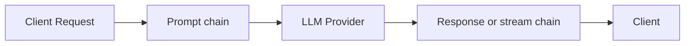

## Overview

A guardrail is a named, configured instance of a [plugin](/advanced/plugins).
Guardrails run inside every [workflow](/advanced/workflows) that references
them, in one of three phases:

- **prompt**: after routing, before the request reaches the provider
- **response**: on the complete response, before it reaches the client
- **stream**: on each streamed event (or on the buffered stream, depending on the plugin)

A guardrail can edit content, add headers, reject the request with an error,
answer it with a safe message, or let it through with a warning.

<Warning>
  A response-phase guardrail needs the complete response, so a workflow that
  runs one buffers every streaming request it matches: the client still asked
  for `stream: true` and still receives SSE, but as one burst once the provider
  has finished, and time to first token becomes the total response time. A
  stream-phase guardrail keeps delivery incremental only when its plugin
  streams too; a plugin whose stream policy buffers has the same effect.
</Warning>

On `/v1/responses`, a stream-phase guardrail may drop, merge, or split events,
so GoModel renumbers what it delivers: `sequence_number` still runs from `0`
without gaps, up to the terminal `response.completed` (or `response.incomplete`
/ `response.failed` on a cut stream).

Guardrails work across all text-based endpoints:

- `/v1/chat/completions`
- `/v1/responses`
- `/v1/messages`

<Note>
  Guardrails for images, TTS, STT, and video models are planned as a separate
  system and are not covered here.
</Note>

## Quick Start

Add a `guardrails` section to your `config/config.yaml`:

```yaml
guardrails:
  enabled: true
  rules:
    - name: "safety-prompt"
      type: "system_prompt"
      order: 0
      system_prompt:
        mode: "decorator"
        content: "Always respond safely and respectfully."
```

That's it. Every request now gets the safety prompt prepended to its system instructions.

## Manage from the Dashboard

Guardrail definitions can also be created and edited from the admin
dashboard instead of `config.yaml` — useful for iterating on rules without a
redeploy, or for operators who don't manage this repo's config directly.


Open **Plugins & Guardrails** in the sidebar and click **Create Guardrail**: give it a
name, pick a type (every loaded plugin with a prompt, response, or stream
hook is listed), optionally scope it to a `user_path`, and fill in the form
the plugin declares. The **Advanced** section holds the failure mode and
timeout. `config.yaml` entries are seeded into the same store at startup and
stay in sync with it, so dashboard-created and config-declared guardrails
appear side by side. The **Plugins** list at the bottom of the page shows
every loaded plugin type, its hooks, source, and health. Not every plugin is a guardrail:
a plugin declares `Guardrail: true` in its manifest when its instances apply
a policy to prompts, responses, or streams, and the dashboard marks those,
and the instances built from them, with a shield. A routing strategy such as
`cheapest_healthy` is listed on the same page but is not a guardrail.

<Note>
  Runtime guardrail execution still depends on `GUARDRAILS_ENABLED`. With it
  off, the page still lets you manage definitions — they just don't run on
  live traffic yet.
</Note>

## How It Works



1. The request is mapped to a unified `Prompt` (system, user, assistant, and tool messages with stable IDs)
2. The **prompt chain** runs: each guardrail edits the prompt, or decides to block, respond, or warn
3. Edits are applied back to the original request, which continues to the provider
4. The **response chain** runs on the complete response (or the **stream chain** on the stream) before anything reaches the client

Guardrails never see the raw API request types — they operate on the unified
[`Exchange`](/advanced/plugins#the-exchange). The same guardrail works
identically for `/chat/completions`, `/responses`, and `/messages`.

## Execution Order

Each guardrail has an `order` value (the workflow step) that controls when it
runs within its phase:

- **Same order** → run **in parallel** (concurrently)
- **Different order** → run **sequentially** (ascending)

```mermaid
flowchart LR
    subgraph Order 0
        A[safety-prompt]
        B[content-policy]
    end
    subgraph Order 1
        C[compliance-check]
    end
    subgraph Order 2
        D[final-filter]
        E[audit-tag]
    end
    Order 0 --> Order 1 --> Order 2
```

Each sequential group receives the output of the previous group. Guardrails
that **edit content** (`system_prompt`, `llm_based_altering`,
`string_replace`, `presidio`) cannot share an order with another editing guardrail; only
one editor per order, and any number of non-editing checks (`llm_judge`,
`header_edit`) next to it. When several guardrails at one order decide
differently, the most severe decision wins: `block` > `respond` > `warn` >
`allow`.

## Configuration

### Full Structure

```yaml
guardrails:
  enabled: true    # Master switch (default: false)
  enable_for_batch_processing: false   # Also run the prompt chain on inline /v1/batches items
  rules:
    - name: "rule-name"          # Unique identifier for this instance
      type: "system_prompt"      # Plugin name
      user_path: "/team/privacy" # Optional base path for internal auxiliary calls
      phase: "prompt"            # prompt (default) | response | stream
      order: 0                   # Step within the phase
      fail_mode: "closed"        # closed (default) | open
      timeout_ms: 0              # Per-call timeout; 0 = none (default)
      config:                    # Plugin settings, validated against the plugin's schema
        mode: "decorator"
        content: "Your prompt text here."
```

`system_prompt` and `llm_based_altering` also accept their settings in a typed
block named after the type (`system_prompt:` / `llm_based_altering:`), as in
the Quick Start. The typed block and `config:` are equivalent; use `config:`
for every other type. Line-oriented keys such as `string_replace.rules` and
the `header_edit` lists accept either a block scalar (`|`) or a YAML list of
strings, joined by newlines.

### Environment Variable

You can toggle guardrails without editing the config file:

```bash
export GUARDRAILS_ENABLED=true
```

Guardrails are built from [plugins](/advanced/plugins), so enabling them also
enables the plugin system (`PLUGINS_ENABLED`, off by default). With both off,
the guardrail endpoints and the dashboard page are unavailable.

### Rule Fields

| Field | Required | Description |
| ----- | -------- | ----------- |
| `name` | Yes | Human-readable identifier. Supports spaces and unicode, but not `/`. |
| `type` | Yes | Plugin name: a built-in type below, or the manifest name of a loaded plugin. |
| `user_path` | No | Optional base user path for internal auxiliary requests. |
| `phase` | No | `prompt`, `response`, or `stream`. Default `prompt`. |
| `order` | No | Execution order within the phase. Default `0`. Same value = parallel, different = sequential. |
| `config` | No | Plugin settings. Keys, defaults, and validation come from the plugin (`GET /admin/guardrails/types`). |
| `fail_mode` | No | `closed` rejects the request with HTTP 500 when the guardrail errors or times out; `open` continues without it. Default `closed`. |
| `timeout_ms` | No | Upper bound for each call of the guardrail, enforced at the deadline. Default `0` (none). A guardrail that edits content and overruns its timeout fails the request even with `fail_mode: open`; see [Fail modes and timeouts](/advanced/plugins#fail-modes-and-timeouts). |

## Guardrail Types

Six types ship with GoModel. Each is a built-in plugin; the tables list its
config keys as they appear under `config:` and on the dashboard form.

### `system_prompt`

Adds, replaces, or decorates the system prompt on every request.

**Phases:** prompt. **Edits content:** yes.

#### Settings

| Key | Required | Default | Description |
| --- | -------- | ------- | ----------- |
| `mode` | No | `inject` | `inject`, `override`, or `decorator`. |
| `content` | Yes | | The system prompt text to apply. |

#### Modes

<Tabs>
  <Tab title="inject">
    Adds a system message **only if none exists**. Existing system prompts are left untouched.

    ```yaml
    - name: "default-system"
      type: "system_prompt"
      order: 0
      system_prompt:
        mode: "inject"
        content: "You are a helpful assistant."
    ```

    **Behavior:**
    - Request has no system prompt → adds one
    - Request already has a system prompt → no change
  </Tab>
  <Tab title="override">
    **Replaces** all existing system messages with the configured content.

    ```yaml
    - name: "strict-system"
      type: "system_prompt"
      order: 0
      system_prompt:
        mode: "override"
        content: "You are a compliance-focused assistant. Follow all company policies."
    ```

    **Behavior:**
    - Any existing system prompts are removed
    - A single new system prompt is set
  </Tab>
  <Tab title="decorator">
    **Prepends** the configured content to the existing system prompt (separated by a newline). If no system prompt exists, adds one.

    ```yaml
    - name: "safety-prefix"
      type: "system_prompt"
      order: 0
      system_prompt:
        mode: "decorator"
        content: "Always respond safely and respectfully."
    ```

    **Behavior:**
    - Existing system prompt `"You are a coding assistant."` becomes:
      ```
      Always respond safely and respectfully.
      You are a coding assistant.
      ```
    - No system prompt → creates one with just the configured content
  </Tab>
</Tabs>

### `llm_based_altering`

Rewrites the text of selected message roles by calling an auxiliary model.
In the prompt phase it rewrites the request; in the response phase it
rewrites the assistant's reply (when `roles` includes `assistant`). This is
useful for PII anonymization and other content-preserving rewrites.

The default `prompt` is derived from LiteLLM's `data_anonymization` guardrail,
so a minimal config acts as an anonymizing preprocessor.

**Phases:** prompt, response. **Edits content:** yes.

#### Settings

| Key | Required | Default | Description |
| --- | -------- | ------- | ----------- |
| `model` | Yes | | Model, alias, or `provider/model` selector for the rewrite call. |
| `provider` | No | | Optional routing hint; folded into `model` as `provider/model`. |
| `roles` | No | `["user"]` | Roles to rewrite: `system` (includes developer), `user`, `assistant`, `tool`. |
| `max_tokens` | No | `4096` | `max_tokens` for the auxiliary rewrite call. |
| `skip_content_prefix` | No | | Skip rewriting when the trimmed text starts with this prefix. |
| `prompt` | No | built-in anonymization prompt | Custom rewrite instructions. |

Rewrites run through the normal translated request path in-process, so
workflow selection, failover, usage, audit, and cache behavior still apply.
The internal request uses:

- path: `/v1/chat/completions`
- user path: `{guardrail.user_path or caller user path}/guardrails/{guardrail name}`
- request origin: `plugin`

Guardrails are skipped for that internal request to avoid recursion. A rewrite
that fails (an error, an empty or truncated reply, a tool call instead of
text) fails the guardrail, so `fail_mode` decides: `closed` rejects the
request, `open` continues with the original text.

#### Example

```yaml
- name: "privacy-rewrite"
  type: "llm_based_altering"
  user_path: "/team/privacy"
  order: 1
  timeout_ms: 20000
  llm_based_altering:
    model: "gpt-4o-mini"
    roles: ["user"]
```

### `string_replace`

Replaces, flags, or blocks text that matches a list of literal or regular
expression rules. Works on prompts, responses, and streams. Rules match
within one text part (a content part or a tool-result part) in every mode;
text split across two parts is not matched.

**Phases:** prompt, response, stream. **Edits content:** yes.

#### Settings

| Key | Required | Default | Description |
| --- | -------- | ------- | ----------- |
| `rules` | Yes | | One rule per line as `find => replace` (the separator is ` => ` with spaces; the replacement may be empty). Blank lines and lines starting with `#` are ignored. `\n`, `\t`, and `\\` are understood on both sides in literal mode and on the replace side in regex mode. |
| `mode` | No | `literal` | `literal` matches the text as written; `regex` uses Go RE2 syntax with `$1`, `$2` capture references in the replacement (`$$` for a literal dollar sign). |
| `case_insensitive` | No | `false` | Match regardless of letter case. |
| `roles` | No | `["user"]` | Prompt messages the rules apply to: `system` (includes developer), `user`, `assistant`, `tool`. In the response phase the assistant text is always the target. |
| `on_match` | No | `replace` | `replace` substitutes; `block` rejects with an error; `respond` answers with `message` as an assistant reply; `warn` continues and records the match. Only `replace` edits the text. |
| `message` | No | `Request blocked by policy` | Error message for `block`, assistant reply for `respond`, audit note for `warn`. |
| `block_status` | No | phase default | One HTTP status code between 400 and 599 for `block`, for example `403`. Empty means 400 when the prompt is blocked, 502 when the response is blocked. |
| `stream_lookbehind` | No | `64` | Characters of streamed text held back so a match spanning two chunks is still rewritten; set it to at least the longest find text. A match at the end of the text streamed so far is held until it stops growing, so an open-ended pattern such as `sk-[A-Za-z0-9]{20,}` masks the whole value when it is at most this long. Used by `replace` and `warn`. |

In the stream phase, `replace` and `warn` transform events in flight with the
configured lookbehind. `block` and `respond` buffer the whole stream so
nothing leaks before the decision, at the cost of delaying the first token
until the response is complete.

#### Example

```yaml
- name: "mask-internal-names"
  type: "string_replace"
  order: 0
  config:
    mode: "literal"
    case_insensitive: true
    rules: |
      Project Falcon => [project]
      ACME Corp => [company]
```

### `header_edit`

Sets, adds, and removes HTTP headers on the request, the client response, and
the upstream provider call. It never edits content, so it can share an order
with an editing guardrail.

**Phases:** prompt, response. **Edits content:** no.

#### Settings

Every key is a list of lines. Set and add lines look like `Name: value`;
remove lines are a bare `Name`. Blank lines and `#` comments are ignored.

| Key | Description |
| --- | ----------- |
| `request_set` | Replace a header on the live request after the prompt phase: visible to later guardrails and request logging, not forwarded to the provider. |
| `request_remove` | Drop a header from the live request after the prompt phase. |
| `response_set` | Replace a header on the response sent to the client. |
| `response_add` | Append a value to a client response header, keeping existing values. Applied once per request even when the instance runs in both phases. |
| `response_remove` | Drop a header from the client response, including headers GoModel adds itself (for example `X-Request-Id`). |
| `upstream_set` | Static headers for the provider call. Recorded but not forwarded in this release. |

Credential headers (`Authorization`, `X-Api-Key`, `Cookie`, ...) can never be
edited, and names containing `secret` or `token` cannot be set.

#### Example

```yaml
- name: "served-by"
  type: "header_edit"
  order: 0
  config:
    response_add: |
      X-Served-By: gomodel
    response_remove: |
      X-Request-Id
```

### `llm_judge`

Asks a judge model whether the prompt (or the response) violates a policy and
blocks, answers, or flags it based on the verdict. The judge must reply with
one JSON object `{"verdict":"allow"|"block","reason":"..."}`; the default
instructions do that and tell the model to ignore instructions inside the
content.

**Phases:** prompt, response, stream (buffered). **Edits content:** no.

#### Settings

| Key | Required | Default | Description |
| --- | -------- | ------- | ----------- |
| `model` | Yes | | Judge model: `provider/model`, an alias, or a virtual model. Its usage is accounted with origin `plugin`. |
| `user_path` | No | current request's path | User path the judge call is scoped to for budgets and audit. |
| `prompt` | No | built-in policy | System prompt for the judge. |
| `target` | No | `auto` | What the judge sees in the prompt phase: `auto` or `last_user` (last user message), `all_user`, `conversation`. In the response phase it always sees the assistant text. |
| `action` | No | `block` | On a block verdict: `block` rejects, `respond` answers with `respond_text`, `warn` continues and records the verdict. |
| `message` | No | `This request was blocked by policy` | Error message for `block`, audit note for `warn`. |
| `block_status` | No | phase default | One HTTP status code between 400 and 599 for `block`, for example `403`. Empty means 400 when the prompt is blocked, 502 when the response is blocked. |
| `respond_text` | No | `I can't help with that request.` | Assistant reply for `respond`. |
| `on_unclear` | No | `warn` | When the judge reply cannot be parsed, was cut off by `max_tokens`, or was spent entirely on reasoning: `allow`, `warn`, or `block` (applies `action`). A verdict counts only as a JSON object or a bare `allow` or `block`, never as a word inside a sentence. |
| `max_tokens` | No | `2048` | Completion cap for the judge call. Unused tokens cost nothing; size it for the judge model's reasoning, not for the verdict. |
| `temperature` | No | `0` | Sampling temperature for the judge call (0 to 2). |

Identical text is judged once per request, so an instance that runs in both
the prompt and the response phase does not double-charge for the same
content. In the stream phase the whole stream is buffered and judged as a
complete response.

#### Sizing `max_tokens` for a reasoning judge

A reasoning judge model spends its completion on thinking before it writes
anything: with a cap that runs out first the judge returns no verdict, and the
instance enforces nothing — it follows `on_unclear` instead, which by default
only warns. The default cap of `2048` leaves room for that; unused tokens are
never billed, so raise it further rather than trimming it when the judge model
reasons a lot.

A judge that reaches no verdict is recorded apart from a reply that was
answered but could not be parsed:

| Code | Meaning |
| ---- | ------- |
| `llm_judge_block` | The judge returned a block verdict; `action` applies. |
| `llm_judge_no_verdict` | The reply was cut off (`finish_reason: length`) or was all reasoning. A warning naming the judge model and the cap is logged, and `on_unclear` applies. |
| `llm_judge_unclear` | The judge answered, but the reply is not a verdict. `on_unclear` applies. |

Check the gateway log for `judge returned no verdict` after configuring an
instance, and set `on_unclear: block` for a policy that must hold even when the
judge answers nothing usable. A judge call that fails outright — provider error,
timeout — is not an unclear verdict: `fail_mode` decides it, like any other
guardrail failure.

#### Example

```yaml
- name: "policy-judge"
  type: "llm_judge"
  order: 5
  timeout_ms: 10000
  config:
    model: "openai/gpt-4o-mini"
    action: "respond"
    respond_text: "I can't help with that request."
```

### `presidio`

Detects personal data with a [Presidio](https://presidio.dataprivacystack.org/)
analyzer and anonymizes, flags, or blocks it. Only the analyzer service is
needed; GoModel rewrites the text itself, so it can put the original values
back into the response.

```bash
docker run -d -p 5002:3000 ghcr.io/data-privacy-stack/presidio-analyzer:latest
```

**Phases:** prompt, response, stream. **Edits content:** yes.

#### Settings

| Key | Required | Default | Description |
| --- | -------- | ------- | ----------- |
| `analyzer_url` | No | `http://localhost:5002` | Base URL of the analyzer service. |
| `api_key` | No | | Bearer token sent as `Authorization`, for an analyzer behind an authenticating proxy. Needs an `https://` URL unless the analyzer is on localhost. |
| `language` | No | `en` | Language code the analyzer runs with. The default image ships only `en`; the instance shows as degraded when the analyzer has no model for the language. |
| `entities` | No | all | Entity types to look for (`PERSON`, `EMAIL_ADDRESS`, `PHONE_NUMBER`, `CREDIT_CARD`, `US_SSN`, ...; see `GET /supportedentities` on the analyzer). |
| `block_entities` | No | | Entity types that reject the request (or answer with `message` when the action is `respond`) whatever the action. |
| `score_threshold` | No | analyzer default | Minimum confidence, 0 to 1. Raise it when common words are taken for names or dates. |
| `allow_list` | No | | Exact words never treated as personal data: product names, your company. |
| `ad_hoc_recognizers` | No | | JSON array of Presidio pattern recognizers (`supported_entity` plus `patterns` or `deny_list`) for identifiers of your own. |
| `roles` | No | `["user", "assistant", "tool"]` | Prompt messages analyzed, tool-result text and tool-call arguments included. In the response phase the assistant text and tool-call arguments are always analyzed. |
| `action` | No | `anonymize` | `anonymize` rewrites the values; `block` rejects with an error; `respond` answers with `message` as an assistant reply; `warn` continues and records the entity types. |
| `operator` | No | `replace` | How `anonymize` rewrites a value: `replace` with a numbered placeholder (`<PERSON_1>`, the same one for every occurrence of that value in the request), `mask` with `*` per character, `redact` (removed), `hash` (SHA-256). |
| `restore` | No | `false` | Put the original values back where the model repeats a placeholder. Needs `operator: replace`; see below. |
| `message` | No | `Request blocked: it contains personal data` | Error message for `block`, assistant reply for `respond`, audit note for `warn`. |
| `block_status` | No | phase default | One HTTP status code between 400 and 599 for `block`. Empty means 400 when the prompt is blocked, 502 when the response is blocked. |
| `stream_chunk` | No | `256` | Characters of streamed text (or tool-call arguments) collected before the analyzer runs on them, so it sees whole sentences and runs once per chunk. The client waits for at most this much text at a time. |
| `stream_lookbehind` | No | `64` | Characters of streamed text (or tool-call arguments) held back so a value or placeholder split across two chunks is still handled. |

Every text part is analyzed on its own (one analyzer call each, up to eight
in flight), so the analyzer never sees the whole conversation as one text and
the analyzer's own limits apply per part. The audit detail records entity
types and counts, never the values, and errors from the analyzer never carry
the text it was given. The analyzer receives the text in clear, so run it as
a sidecar on the same host or reach it over `https://` or a private network.

<Tip>
  Start with an explicit `entities` list. With every type enabled, the
  analyzer's language model also reports `DATE_TIME`, `LOCATION`, `NRP`, and
  `URL`, which turns phrases like "a nice day" or "Paris" into placeholders
  in both the prompt and the reply. `PERSON`, `EMAIL_ADDRESS`, `PHONE_NUMBER`,
  `CREDIT_CARD`, `IBAN_CODE`, and the national identifiers you need cover most
  deployments. Some models, Claude among them, treat unexplained
  `<PERSON_1>`-style tokens with suspicion and may refuse to repeat them; a
  system prompt line such as `Values like <PERSON_1> are privacy placeholders;
  use them as ordinary values` fixes that.
</Tip>

In the stream phase, `anonymize` and `warn` transform events in flight in
chunks of `stream_chunk` characters with `stream_lookbehind` of overlap; a
`block_entities` type found mid-stream cuts the stream before that chunk
reaches the client. `block` and `respond` buffer the whole stream so nothing
leaks before the decision.

#### Restoring values

With `restore: true` the prompt phase replaces values with numbered
placeholders and remembers them for the request; the response or stream
phase puts the values back where the model repeats a placeholder, in text
and in tool-call arguments, so the client sees its own data while the
provider never does. Set `restore` on the instances in both phases: the
prompt-phase instance records the values, the response-phase instance
restores them. Only values from user messages, earlier assistant turns, and
tool results are put back; a value from a system or developer message stays
a placeholder, so a user cannot make the model reveal it. A value the model
produced on its own is still anonymized on the way out. Such responses are
kept out of the [response cache](/features/cache). Placeholder-shaped text
already in the conversation, such as a `<PERSON_2>` an earlier reply carried
back, is left as it is and its number is never reused for a new value.

Streamed tool-call arguments are restored in flight as well, each call's
arguments as a window of its own under `stream_lookbehind`, including
placeholders whose angle brackets the provider escaped (Gemini returns
`\u003cPERSON_1\u003e`).

#### Example

```yaml
- name: "pii-in"
  type: "presidio"
  order: 1
  timeout_ms: 5000
  config:
    entities: ["PERSON", "EMAIL_ADDRESS", "PHONE_NUMBER"]
    block_entities: ["CREDIT_CARD", "US_SSN"]
    restore: true

- name: "pii-out"
  type: "presidio"
  phase: "response"
  order: 1
  timeout_ms: 5000
  fail_mode: "open"
  config:
    entities: ["PERSON", "EMAIL_ADDRESS", "PHONE_NUMBER"]
    restore: true
```

## Examples

### Single Safety Guardrail

The simplest setup — add a safety prefix to every request:

```yaml
guardrails:
  enabled: true
  rules:
    - name: "safety"
      type: "system_prompt"
      order: 0
      system_prompt:
        mode: "decorator"
        content: "Always be safe, respectful, and helpful."
```

### Checks in Parallel with an Editor

A non-editing check shares order `0` with the system prompt editor and runs
concurrently with it:

```yaml
guardrails:
  enabled: true
  rules:
    - name: "safety-prompt"
      type: "system_prompt"
      order: 0
      system_prompt:
        mode: "decorator"
        content: "Always be safe and respectful."

    - name: "policy-judge"
      type: "llm_judge"
      order: 0
      config:
        model: "openai/gpt-4o-mini"
```

### Sequential Pipeline

Guardrails with different orders run one after another. Later groups see the output of earlier ones:

```yaml
guardrails:
  enabled: true
  rules:
    # Step 1: ensure a system prompt exists
    - name: "default-system"
      type: "system_prompt"
      order: 0
      system_prompt:
        mode: "inject"
        content: "You are a helpful assistant."

    # Step 2: decorate whatever system prompt is now present
    - name: "safety-prefix"
      type: "system_prompt"
      order: 1
      system_prompt:
        mode: "decorator"
        content: "[SAFETY] Always respond within company guidelines."

    # Step 3: anonymize user text before it reaches the main model
    - name: "privacy-rewrite"
      type: "llm_based_altering"
      order: 2
      llm_based_altering:
        model: "gpt-4o-mini"
        roles: ["user"]
```

### Response Phase: Redact Secrets on the Way Out

Runs on the complete response before it reaches the client. Set
`fail_mode: open` if you prefer an unredacted answer over a 500 when the
guardrail itself fails.

```yaml
guardrails:
  enabled: true
  rules:
    - name: "mask-keys"
      type: "string_replace"
      phase: "response"
      order: 10
      config:
        mode: "regex"
        rules: |
          sk-[A-Za-z0-9]{20,} => [redacted]
          AKIA[0-9A-Z]{16} => [redacted]
```

### Stream Phase: Redact In Flight and Judge the Whole Answer

The same instance can be referenced in several phases. `mask-keys` transforms
streamed chunks in flight (64 characters of lookbehind, so a key split across
two chunks is still caught). `answer-judge` needs the whole answer, so it
buffers the stream and the client receives it once the verdict is in.

```yaml
guardrails:
  enabled: true
  rules:
    - name: "mask-keys"
      type: "string_replace"
      phase: "stream"
      order: 10
      config:
        mode: "regex"
        rules: |
          sk-[A-Za-z0-9]{20,} => [redacted]

    - name: "answer-judge"
      type: "llm_judge"
      phase: "stream"
      order: 20
      config:
        model: "openai/gpt-4o-mini"
        action: "respond"
```

<Tip>
  A rule in `config.yaml` places one instance in one phase. To run the same
  instance in two phases, add it to the workflow twice with different
  `phase` values on the dashboard or through `POST /admin/workflows`; see
  [Workflows](/advanced/workflows#guardrail-steps).
</Tip>

## How It Works With Different Endpoints

Guardrails operate on a unified message format internally. The adaptation between API-specific request types and this format happens automatically:

| Endpoint | System prompt source | User messages source |
| --- | --- | --- |
| `/v1/chat/completions` | `messages` with `role: "system"` | `messages` array |
| `/v1/responses` | `instructions` field | `input` field |
| `/v1/messages` | `system` field | `messages` array |

<Tip>
  You don't need to think about which endpoint your users call. A single
  guardrail rule works identically for all supported text endpoints.
</Tip>

For `/v1/messages`, a request that runs any guardrail takes the translated
path (the native passthrough is skipped). A response cut by a guardrail is
reported with `finish_reason: "content_filter"` on OpenAI-compatible
endpoints and `stop_reason: "end_turn"` on `/v1/messages`.

## Guardrails and the Response Cache

The [response cache](/features/cache) stores the reply the response and stream
chains already produced, and a cache hit replays it without running those
chains again. Both cache layers therefore key on the guardrail chain the
request resolves to, across all three phases:

- Editing, adding or removing a step makes every entry stored under the old
  chain unreachable; the next request runs the full pipeline and stores its own
  entry.
- Two workflows with different chains never share entries, so a tenant whose
  workflow redacts on the way out is never served another tenant's unredacted
  reply.
- A blocked response is not a cacheable response, so a blocking guardrail can
  never be skipped by a hit.

Prompt-phase guardrails run before the cache is consulted, so a prompt-phase
block or answer applies to a request that would otherwise have been a hit. A
response a guardrail restores request-specific data into is never cached at all
(see `restore` under [`presidio`](#presidio)).

Because the response chain does not run on a hit, the audit entry for a hit
records the prompt-phase outcomes only, plus the cache type.

## Decisions, Errors, and Rejection

| Outcome | What the client sees |
| --- | --- |
| **block** | An error in the endpoint's native format: HTTP 400 (prompt phase) or 502 (response and stream phases) unless the guardrail sets `block_status`; code `guardrail_blocked` unless the plugin sets its own. |
| **respond** | An ordinary assistant reply with HTTP 200 (a one-turn stream for streaming requests). |
| **warn** | The unchanged response plus an `X-GoModel-Guardrail: warn; code=<code>` header; the detail is stored in the audit trail. On a stream the header is sent only when the warn was decided before the first bytes went out (a buffered response); later warns are audit-only. |
| **guardrail failure** (`fail_mode: closed`) | HTTP 500 with code `plugin_failure`. The guardrail's name is in the logs and audit record, not in the client message. |

A blocked request never reaches the provider; a blocked response never
reaches the client. See [Plugins](/advanced/plugins#decisions) for how
decisions merge when several guardrails run at the same order.

Every outcome, a silent allow included, is recorded in the request's audit
entry under `data.guardrails`, with the phase, step, decision, whether the
guardrail edited the request or response, and how it failed. The dashboard
colors the guardrail steps of an audit entry's workflow chart from it: green
when the step passed or edited, amber for a warning or a fail-open error,
red for a block, an answer or a fail-closed error, dimmed when the step never
ran. See [Plugins](/advanced/plugins#audit-trail) for the fields.
