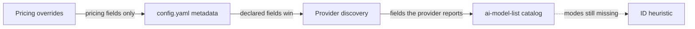

Every model in the catalog carries metadata — pricing, context window, max output
tokens, capabilities, and modes (which decide whether it shows up as a chat,
embeddings, image, or audio model). GoModel assembles it from five sources,
strongest first:



## The sources

1. **Pricing overrides** — set per model in the dashboard's **Models** page.
   The top layer for pricing fields only; unset price types keep inheriting.
   See [Cost tracking](/features/cost-tracking).
2. **`config.yaml` metadata** — `providers.<name>.models` entries can attach
   `metadata` (`pricing`, `context_window`, `modes`, `capabilities`, …). Declared
   fields win field-by-field over everything below; omitted fields inherit. This
   is the escape hatch for local models: declaring `modes: [embedding]` also
   derives the model's category.
3. **Provider discovery** — some providers report metadata in their own model
   listings, and what a provider says about its own deployment wins over the
   catalog field by field: Gemini's `supportedGenerationMethods`, Cohere's
   per-model `endpoints` and context length, OpenRouter's architecture
   modalities and context length, Chutes' context length, max output,
   capabilities, and pricing, Ollama's `/api/show` capabilities, and llama.cpp's
   context window and modalities (see [llama.cpp](/providers/llamacpp)). This
   matters most for self-hosted servers, where the running process is the only
   source that can know the real context window. Models declared via configured
   model lists skip this step.
4. **The model catalog** — the
   [`ai-model-list`](https://github.com/ENTERPILOT/ai-model-list) registry,
   fetched from `MODEL_LIST_URL` (default: the registry's `models.min.json` on
   GitHub) at startup and on every catalog refresh. It supplies the rich
   defaults — pricing, context windows, capabilities, modes — for most hosted
   models, matching IDs directly, through aliases, and with release-date
   suffixes stripped, and it fills in every field the provider above did not
   report. Wrong or missing data is best fixed by contributing to the registry;
   use an override for an immediate fix.
5. **ID heuristic** — a last-resort name check for models that end up with no
   modes at all (typical for llama.cpp and LM Studio): IDs containing `embed` or
   matching well-known embedding families (`bge`, `e5`, `gte`, `minilm`) become
   embedding models, IDs containing `rerank` become reranking models. Namespaced
   IDs are matched by their final path segment. When unsure, it claims nothing.

## What metadata affects

- **Pricing** drives [cost tracking](/features/cost-tracking), budgets, and
  `cost` load-balancing. Each priced field remembers its source, so the
  dashboard can show where a rate came from.
- **Modes and categories** drive dashboard grouping only — routing never
  blocks on them, so `/v1/embeddings` reaches any model
  the provider serves.
- **Context window and capabilities** are advertised on `GET /v1/models` (and
  on `GET /v1/models/{model}` for a single model) for clients that pick models
  dynamically.

## Offline behavior

If the catalog fetch fails or the deployment is air-gapped, the gateway runs
normally — only the catalog-supplied defaults (including catalog pricing) are
missing. Pricing overrides, `config.yaml` metadata, provider discovery signals,
and the ID heuristic still apply.

`MODEL_LIST_URL` accepts a local file as well as an HTTP URL:

```bash
MODEL_LIST_URL=/etc/gomodel/models.json          # bare path
MODEL_LIST_URL=file:///etc/gomodel/models.json   # file URL
```

A file is read on startup and on every cache refresh, and re-parsed only when
its content changes, so you can update pricing by replacing the file. Because
a file involves no network request, it keeps working under
`GOMODEL_OFFLINE=true`, which drops HTTP catalog URLs. Set `MODEL_LIST_URL=off`
to turn the catalog off entirely and declare metadata in `config.yaml`; see the
[production guide](/guides/production#air-gapped-and-offline-deployments) for
the full air-gap checklist.
